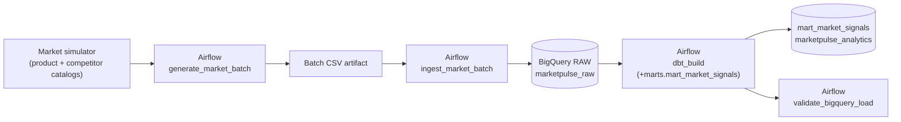
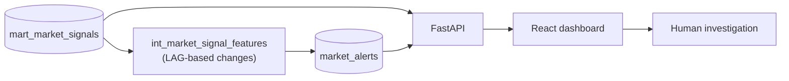
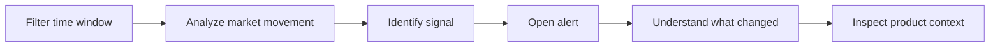

# MarketPulse — Automated Competitive Intelligence Pipeline


**An end-to-end data and analytics engineering project with a decision-support interface.** MarketPulse turns recurring competitor observations (pricing, stock availability, promotions) into explainable, rule-based alerts that an analyst can investigate.


> **About the data.** MarketPulse runs on a **deterministic synthetic market simulator**. It does not scrape retailers, consume an external market feed, or monitor real-world markets. Labels such as "LIVE FEED" and "LIVE MARKET INTELLIGENCE" in the dashboard refer to this simulated observation stream. Signal detection is rule-based SQL, not machine learning.

---

## Overview

| | |
|---|---|
| **What** | A pipeline from data generation to a monitoring dashboard |
| **Problem** | Competitor prices, stock and promotions change constantly. Raw observation tables don't show *what changed* or *whether it matters* |
| **How** | Python simulator → BigQuery → Airflow → dbt → FastAPI → React |
| **Output** | Per-product market snapshots, snapshot-over-snapshot changes, and alerts with plain-English explanations |
| **Evidence** | Dashboard screenshots, a layered dbt model chain, 66 automated tests (61 Python, 5 frontend), a validated warehouse |

Each hourly batch covers 12 products across 4 competitors (48 observations). MarketPulse compares every market snapshot with the previous one, applies explicit thresholds, and records an alert when a change is large enough to investigate. Alerts describe **competitor** market conditions only. The system has no internal or "owned" price.

---

## Architecture

**Core pipeline** (what the Airflow DAG runs):



**Alert path** (implemented in dbt SQL, built separately from the DAG):



> **Orchestration scope.** Airflow orchestrates batch generation, ingestion, dbt transformation through the market-signal mart, and validation. The `market_alerts` model is implemented in dbt and validated separately; adding it to the DAG's dbt selection is a planned orchestration improvement. A DAG run does not by itself refresh `market_alerts`.

| Layer | Technology | Responsibility |
|---|---|---|
| Source | Python, NumPy, Pandas | Deterministic market observations |
| Ingestion | Python, BigQuery client | Validate and append batches to RAW |
| Warehouse | BigQuery (`asia-south1`, Sandbox/free quota) | `marketpulse_raw`, `marketpulse_analytics` |
| Orchestration | Airflow 3.3.2 (Python 3.12 runtime), Docker, PostgreSQL 16 metadata DB, LocalExecutor | Generate → ingest → dbt → validate |
| Transformation | dbt 2.0.6, dbt-utils 1.4.1, SQL | Snapshots, temporal features, alerts |
| Serving | FastAPI | Boundary between warehouse and UI |
| Presentation | React, TypeScript, Vite | Monitoring and investigation |

### How one observation moves through the system

1. **Generate.** The simulator produces price, stock and promotion data for one product–competitor pair at a given hour. The same timestamp and seed always give the same result.
2. **Stage.** `generate_market_batch` writes the batch to a CSV in the Airflow-mounted data directory and passes only metadata through XCom.
3. **Load.** `ingest_market_batch` reads the CSV and appends it to `marketpulse_raw.raw_market_observations`.
4. **Model.** `dbt_build` builds the models up to `mart_market_signals`: one row per product, market, currency and timestamp.
5. **Detect.** The feature and alert models compare each snapshot with the previous one using `LAG()` and record alerts that cross a threshold.
6. **Serve and review.** FastAPI exposes snapshots and alerts to the dashboard, where an analyst filters, drills in and reads the explanation.

---

## Data Model

### RAW layer

`marketpulse_raw.raw_market_observations` is **append-oriented** and **partitioned daily by `observed_at`**. Data is loaded with an explicit schema through the ingestion pipeline.

| Column | Type | Column | Type |
|---|---|---|---|
| `observation_id` | STRING | `market` | STRING |
| `batch_id` | STRING | `observed_at` | TIMESTAMP |
| `product_id` | STRING | `price` | NUMERIC |
| `product_name` | STRING | `currency` | STRING |
| `category` | STRING | `stock_status` | STRING |
| `brand` | STRING | `stock_quantity` | INT64 |
| `competitor_id` | STRING | `promotion_flag` | BOOL |
| `competitor_name` | STRING | `promotion_pct` | NUMERIC |
| `source` | STRING | `ingested_at` | TIMESTAMP |

The RAW layer preserves ingested observations in their source-oriented structure so downstream transformations can be rebuilt independently. Daily partitioning lets queries that filter on `observed_at` read only the relevant partitions; no performance gain was measured for this project.

### dbt layers

| Layer | Model | Purpose |
|---|---|---|
| Staging | `stg_market_observations` | Standardizes raw observations for downstream models |
| Intermediate | `int_competitor_pricing` | Competitor-level features: average/min/max price, spread, price rank, percentage differences, competitor counts, inventory and promotion indicators |
| Mart | `mart_market_signals` | One row per **product + market + currency + observed_at**: competitor count, price statistics, spread and spread %, deterministic lowest/highest competitor, inventory availability, promotion share, market price pressure, promotion indicator |
| Intermediate | `int_market_signal_features` | `LAG()`-based changes between consecutive snapshots: average price change (absolute and %), spread, inventory, promotion and market-pressure changes, direction indicators |
| Mart | `market_alerts` | Converts threshold breaches into alert records with signal type, severity and a readable message |

---

## Signal Detection

Detection is **rule-based and deterministic**, implemented in the dbt/SQL analytical layer. There is no separate Python signal engine and no machine learning. Each rule compares a snapshot with the previous snapshot for the same product and market.

| Signal | Fires when |
|---|---|
| `PRICE_MOVEMENT` | Absolute change in average competitor price ≥ **2.5%** |
| `PROMOTION_SURGE` | Share of competitors promoting rises ≥ **25 percentage points** |
| `INVENTORY_PRESSURE` | Share of competitors in stock falls ≥ **25 percentage points** |
| `PRICE_DISPERSION` | Market price pressure increases by ≥ **0.06** (6 percentage points); implemented as `market_price_pressure_change` ≥ 0.06 |

### Severity

| Signal | LOW | MEDIUM | HIGH |
|---|---|---|---|
| `PRICE_MOVEMENT` | 2.5% to < 3.75% | 3.75% to < 5% | ≥ 5% |
| `PROMOTION_SURGE` | 25 pp | 50 pp | 75+ pp |
| `INVENTORY_PRESSURE` | 25 pp | 50 pp | 75+ pp |
| `PRICE_DISPERSION` | 6 to < 9 pp | 9 to < 12 pp | ≥ 12 pp |

With four competitors, each one represents 25 percentage points, so promotion and inventory severity corresponds to 1, 2, or 3+ competitors changing state.

### Readable alert messages

Each alert includes a generated sentence, for example:

> *Competitors in stock decreased from 100.00% to 50.00%, a decline of 50.00 percentage points.*

The before value, after value and size of the change are visible without writing a query, which speeds up triage and makes each alert easy to audit.

---

## Dashboard

### The investigation workflow

The dashboard is built around one path from a time window to an explained alert:



Filters for product, market, signal, severity and a from/to time window apply across the dashboard, and the filter panel shows how many are active. Narrowing the window changes what the KPIs, charts and lists summarize, so an analyst can focus on a specific period before drilling into a single alert.

### Walkthrough

The screenshots show **captured dashboard states using a selected time window**. They are examples of the application working against a populated demo dataset, not a summary of the whole warehouse. In particular, the "Latest observation" in the header (Oct 07, 10:00 UTC) is the latest observation visible in that captured state.

#### Overview


*A captured state with 2 active filters (from 06-10-2026 00:04 to 07-10-2026 16:04) and 100 snapshots in view. The market-health card reads "At risk" with 5 high-severity alerts; KPI cards show total alerts (294 in this capture), products monitored, average competitor price, in-stock share and promotion share. Selectors for product, market, signal and severity sit above, with a Clear all control.*

#### Signals


*Signals grouped into four families (Promotion, Inventory, Price, Dispersion) with active and recorded counts, plus a competitive price trend (USD average) beside a current-position summary.*


*Mean in-stock share and mean promotion share per snapshot, plotted together.*


*Recent changes with severity badges next to a product watchlist showing price, in-stock share and latest signal.*

#### Investigation


*Selecting a signal opens a drawer with severity, product, market and currency, a "What changed" explanation, and the latest matching snapshot (average, lowest and highest competitor price, in-stock and promotion share). The drawer notes that snapshot values are not necessarily from the alert's timestamp.*

#### Alerts


*A scrollable investigation queue with severity, signal type, product, explanation and timestamp for each alert. This capture showed 100 alerts in the current result.*

#### Products


*Latest snapshot per product and market: category, brand, average price, spread, in-stock %, promotion % and last update time.*

---

## Engineering Highlights

- **Reproducible simulation.** NumPy RNG seeded from a SHA-256-derived value built from the simulator version, the seed and the canonical timestamp. Timestamps are UTC-normalized. Observation IDs are deterministic; batch IDs are UUIDs.
- **Single-batch ingestion contract.** The ingestion pipeline requires a dataframe with exactly one `batch_id`, loads with an explicit schema, and returns `batch_id`, `rows_received`, `rows_loaded`, `ingestion_timestamp` and `table_id`.
- **Duplicate detectability.** Deterministic observation IDs make duplicate observations detectable. This README does not claim the ingestion layer prevents duplicates.
- **Lightweight orchestration.** Airflow passes file locations and metadata through XCom, not datasets.
- **Layered modeling.** Each dbt layer has one responsibility, and alert rules live in SQL beside the features they use.
- **Temporal features.** All change metrics and signals derive from `LAG()` over prior snapshots.
- **Warehouse/UI separation.** The browser talks only to FastAPI, never to BigQuery.
- **Backfill tooling.** `scripts/backfill_market_history.py` generates one deterministic batch per hour and ingests each through the standard pipeline.

---

## Testing & Validation

**66 automated tests: 61 Python tests and 5 frontend tests.** The frontend production build also succeeds. These are application tests, not dbt tests.

| Suite | Result |
|---|---|
| Python / backend (`pytest`) | 61 passed |
| Frontend (Vitest) | 5 passed |
| Frontend production build | Succeeds |

The dbt project was validated in its configured environment: `dbt deps` and `dbt debug` ran successfully, and a manual `dbt build` of the selection shown under [Running the Pipeline](#running-the-pipeline) completed successfully.

**Validated warehouse state**

| Check | Result |
|---|---|
| RAW observations / unique observation IDs / duplicate IDs | 2,304 / 2,304 / 0 |
| RAW batches | 48 |
| RAW observation range | Oct 5 09:00 UTC → Oct 7 21:00 UTC |
| `mart_market_signals` rows | 576 (12 products × 48 snapshots) |
| Snapshots containing alerts | 46 (Oct 6 00:00 → Oct 7 21:00 UTC) |

The unique-ID result shows the validated dataset has no duplicate observation IDs. It is a data check, not a claim about ingestion-time deduplication.

---

## Current Dataset

These are example values for the development/demo dataset, not system limits.

| Metric | Value |
|---|---|
| Products / competitors | 12 / 4 |
| Observations per hourly batch | 48 |
| RAW observations | 2,304 across 48 batches |
| `mart_market_signals` rows | 576 across 48 snapshots |
| Snapshots containing alerts | 46 |

The screenshots show a filtered view of this data (a selected time window), so their figures, such as 294 alerts and 100 snapshots in view, describe that captured state and are not warehouse totals.

---

## Project Structure

```text
marketpulse/
├── airflow/dags/marketpulse_simulator_dag.py   # generate → ingest → dbt → validate
├── api/                                        # FastAPI service
├── config/settings.py                          # Environment-driven configuration
├── dbt/                                        # staging / intermediate / marts
├── docs/                                       # Documentation and screenshots
├── frontend/                                   # React + TypeScript + Vite dashboard
├── ingestion/
│   ├── loader.py                               # BigQuery table + load logic
│   └── pipeline.py                             # Batch validation + ingestion result
├── scripts/backfill_market_history.py          # Hourly historical backfill
├── simulator/market_simulator.py               # Deterministic market simulator
├── tests/                                      # Pytest suite
├── docker-compose.yaml
├── Dockerfile.airflow
├── requirements.txt
├── airflow-requirements.txt
├── dbt-requirements.txt
└── .env.example
```

---

## Getting Started

### Prerequisites

- Python 3 and Node.js with npm
- Docker, for the Airflow stack
- A Google Cloud project with BigQuery enabled (Sandbox/free quota is sufficient)
- Google Application Default Credentials (ADC) for BigQuery authentication. Your environment supplies credentials to the BigQuery client, so no key files or secrets live in the repository.

### Install

```bash
# Backend (inside a virtual environment)
python -m pip install -r requirements.txt -r api/requirements.txt

# Frontend
cd frontend
npm install
```

### Environment configuration

Copy `.env.example` to `.env` and `frontend/.env.example` to `frontend/.env`, then fill in your own values. **Never commit credentials or service-account files.**

| Variable | Used by | Notes |
|---|---|---|
| `GCP_PROJECT_ID` | Ingestion, API | Your Google Cloud project ID |
| `BIGQUERY_DATASET` | Ingestion | RAW dataset: `marketpulse_raw` |
| `BIGQUERY_TABLE` | Ingestion | `raw_market_observations` |
| `BIGQUERY_LOCATION` | Ingestion, API | `asia-south1` |
| `BIGQUERY_ANALYTICS_DATASET` | API | `marketpulse_analytics` |
| `VITE_API_BASE_URL` | Frontend | e.g. `http://127.0.0.1:8000` |

---

## Running the Pipeline

**1. Start the Airflow stack.** It is defined in `docker-compose.yaml` and `Dockerfile.airflow` and runs Airflow with a PostgreSQL 16 metadata database and the LocalExecutor.

**2. Trigger the DAG** from the Airflow UI. It runs four tasks in order:

| Task | What it does |
|---|---|
| `generate_market_batch` | Generates a batch and writes a CSV to the mounted data directory; passes metadata via XCom |
| `ingest_market_batch` | Reads the CSV and loads it through the ingestion pipeline |
| `dbt_build` | Runs dbt with the selection `+marts.mart_market_signals` |
| `validate_bigquery_load` | Validates the resulting BigQuery load |

**3. Build `market_alerts`.** The model is not in the DAG's dbt selection, so it is built with a separate dbt run. This command was run successfully in the Airflow container's configured dbt environment (the paths are container paths), after `dbt deps` and `dbt debug` had passed:

```bash
dbt build \
  --project-dir /opt/airflow/marketpulse/dbt \
  --profiles-dir /opt/airflow/dbt-config \
  --target dev \
  --target-path /opt/airflow/marketpulse/data/dbt-target \
  --select +marts.mart_market_signals marts.market_alerts
```

**4. (Optional) Backfill history** so trends have data to show:

```bash
python scripts/backfill_market_history.py \
    --start "2026-10-06T00:00:00Z" \
    --hours 46
```

The script also accepts `--seed`. It generates simulated history and does not read from an external provider.

**5. Start the API:**

```bash
python -m uvicorn api.main:app --reload
```

**6. Start the dashboard:**

```bash
cd frontend
npm run dev
```

**7. Run the tests:**

```bash
python -m pytest tests -q
cd frontend && npm test && npm run build
```

---

## API

FastAPI sits between the analytical warehouse and the React interface, so the UI never queries BigQuery directly. The service exposes five `GET` routes:

| Route | Purpose |
|---|---|
| `GET /health` | Service health check |
| `GET /products` | Product dimensions |
| `GET /market-signals` | Market snapshots with competitive metrics |
| `GET /alerts` | Alert records |
| `GET /alerts/summary` | Alert counts summary |

```bash
curl "http://127.0.0.1:8000/market-signals?limit=100"
```

Query parameters and response details are in [`api/README.md`](api/README.md).

---

## Design Decisions

| Decision | Reasoning |
|---|---|
| BigQuery RAW + analytics datasets | Source-oriented data is kept separate from modeled data, so models can be rebuilt without regenerating observations |
| Airflow | Makes the generate → ingest → transform → validate sequence explicit and re-runnable |
| dbt | Version-controlled SQL with clear layers and dependencies |
| Deterministic simulator | Reproducible data for testing, debugging and demos, with no external dependency |
| Rule-based alerts | Transparent thresholds and alerts that can be explained to a non-technical reader |
| FastAPI between warehouse and UI | Keeps credentials and SQL out of the browser and gives the UI a small contract |

---

## Limitations

Deliberate scope boundaries for a portfolio project:

- **Simulated data.** Observations come from a deterministic simulator, not an external source.
- **Rule-based detection.** Fixed thresholds, not learned models.
- **Alerts outside the DAG.** `market_alerts` is implemented and validated but is not part of the DAG's dbt selection.
- **Manual orchestration.** The DAG is triggered manually; no schedule is configured.
- **Single market in the demo data.** The captured dashboard showed one market and one currency.
- **Development/demo environment.** Not a deployed or production service.

## Future Improvements

*None of the following is implemented.*

- Add `market_alerts` to the DAG's dbt selection and schedule the DAG
- Connect real data sources in place of the simulator
- More markets and currencies
- dbt incremental models
- Ingestion-time duplicate protection
- Alert delivery and pipeline observability
- API pagination and authentication
- Cloud-native deployment
- ML-based anomaly detection alongside the rules

---

## Why This Project Matters

MarketPulse covers the full path from data generation to a decision interface: reproducible simulation, typed warehouse loading, orchestration, layered SQL modeling with temporal features, explainable rule-based detection, an API boundary and a tested React front end. It shows how to design each stage with clear contracts and honest scope.
