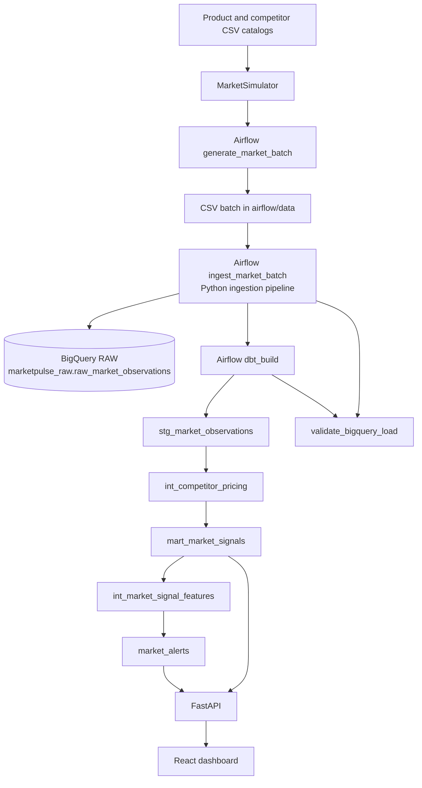

# MarketPulse architecture

MarketPulse converts synthetic competitor observations into product/market snapshots, temporal changes, and rule-based alerts. The browser consumes the read-only API; only the API and ingestion/dbt services access BigQuery.

## System flow

The Airflow DAG `marketpulse_simulator_test` has `schedule=None`, so it is manually triggered. It generates a batch, ingests it, runs `dbt build --select +marts.mart_market_signals`, then validates the corresponding raw batch. The `+` selector includes upstream dbt dependencies of the market-signals mart. It does not include downstream dependents, so the current DAG selection does not refresh `int_market_signal_features` or `market_alerts`.

## Ingestion and raw warehouse

The Python simulator uses the product and competitor catalogs to create market observations for a supplied `observed_at`. Its per-timestamp seeded generation makes market fields reproducible for the same seed and instant; `batch_id` remains unique per generated batch. Each generated batch is stored as CSV for the Airflow tasks to share.

The ingestion pipeline validates batch metadata and required fields, then uses the BigQuery loader to append the rows. The loader ensures the configured raw dataset/table exists and writes the observation payload with an ingestion timestamp. `observed_at` is the daily partition field.

The project’s example ingestion configuration identifies:

- Project: `marketpulse-510219`.
- Raw dataset: `marketpulse_raw`.
- Raw table: `raw_market_observations`.
- Location: `asia-south1`.

Ingestion requires `GCP_PROJECT_ID`, `BIGQUERY_DATASET`, `BIGQUERY_TABLE`, and
`BIGQUERY_LOCATION` to be set. These are supplied in the root `.env.example`;
unlike the API, the ingestion settings do not provide defaults.

The raw schema contains observation and batch IDs, product/competitor dimensions, market, currency, timestamp, observed price, stock status/quantity, promotion flag/percentage, source, and ingestion timestamp.

## dbt transformation layers

dbt uses the `marketpulse` profile and the `marketpulse_analytics` dataset by default. The project uses strict static analysis and materializes staging/intermediate models as views and marts as tables.

| Layer | Model | Responsibility |
| --- | --- | --- |
| Source | `marketpulse_raw.raw_market_observations` | Immutable appended raw observation rows. |
| Staging | `stg_market_observations` | Casts and normalizes raw fields into analytics types. |
| Intermediate | `int_competitor_pricing` | Derives product/market snapshot pricing, rank, stock, and promotion indicators. |
| Mart | `mart_market_signals` | Produces one row per product, market, currency, and `observed_at`, with competitor price, spread, inventory, and promotion metrics. |
| Temporal features | `int_market_signal_features` | Uses `LAG()` over product/market/currency history to add previous metrics, changes, and directions. The first available snapshot has `NULL` previous/change fields. |
| Alert mart | `market_alerts` | Emits one row for each rule that fires, with a signal type, severity, values, and deterministic human-readable message. |

The analytics dataset also contains the materialized dbt tables/views corresponding to these models: `stg_market_observations`, `int_competitor_pricing`, `mart_market_signals`, `int_market_signal_features`, and `market_alerts`.

### Alert rules

The alert rules are deterministic and do not use an internal price:

- `PRICE_MOVEMENT`: absolute average competitor price change of at least 2.5%; severity bands are 2.5–<3.75%, 3.75–<5%, and ≥5%.
- `PROMOTION_SURGE`: promotion share increases by at least 25 percentage points; with four competitors this equals one additional competitor. Severity corresponds to a one, two, or at least three competitor increase.
- `INVENTORY_PRESSURE`: in-stock share decreases by at least 25 percentage points; severity corresponds to one, two, or at least three competitors moving out of stock.
- `PRICE_DISPERSION`: price spread as a percentage of average price increases by at least 6 percentage points. The threshold is documented against the deterministic simulator sample in the alert model YAML; severity bands begin at 6, 9, and 12 percentage points.

Signal conditions, severity mappings, and rationale are documented in `dbt/models/marts/market_alerts.yml`.

## API layer

`api/main.py` exposes `GET /health`, `/products`, `/market-signals`, `/alerts`, and `/alerts/summary`. `api/bigquery_client.py` provides one cached ADC-authenticated BigQuery client and trusted project/dataset/table identifiers. User-supplied filters are BigQuery query parameters. The API returns sanitized server errors rather than query internals.

Configuration defaults are project `marketpulse-510219`, dataset `marketpulse_analytics`, and location `asia-south1`; the environment variables are `GCP_PROJECT_ID`, `BIGQUERY_ANALYTICS_DATASET`, and `BIGQUERY_LOCATION`. The API needs ADC and BigQuery access for analytics endpoints; `/health` is process-only.

## Frontend

`frontend/` is a React/TypeScript single-page dashboard built with Vite. `src/api.ts` is the typed fetch client. `App.tsx` loads the API resources and coordinates filters, derived KPIs, loading/error states, and selected-product state. Reusable components in `src/components/` render the overview, charts, tables, filters, and product detail. The browser calls FastAPI only and never queries BigQuery.

For local development, FastAPI allows browser origins `http://localhost:5173` and `http://127.0.0.1:5173` only. This allowlist is not a production deployment configuration.

## Authentication and operational limitations

- The API does not currently implement user authentication or authorization. BigQuery access is based on the API process's ADC identity.
- CORS is restricted to local Vite origins; production origins must be deliberately configured before deployment.
- The simulator is synthetic, not a live competitor-price collection integration.
- The current Airflow task selection does not refresh the downstream temporal feature or alert models.
- The DAG is manually triggered, not scheduled.
- API list endpoints cap results at 100 and do not provide pagination.
- Python dependency manifests are not fully locked; installs may resolve newer compatible packages over time.

## Reproducing the local API and dashboard

The API's defaults can be overridden with `GCP_PROJECT_ID`, `BIGQUERY_ANALYTICS_DATASET`, and `BIGQUERY_LOCATION`. The API requires ADC with access to the analytics dataset for data routes. For local browser requests, the frontend environment variable `VITE_API_BASE_URL` defaults to `http://127.0.0.1:8000`.

See the root [README](../README.md) for the quickstart, verified validation summary, and repository map, and [API README](../api/README.md) for endpoint contracts and examples.
